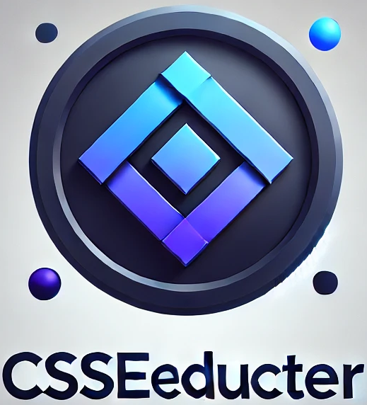

<p align="center">
  
</p>
<h1 align="center">
  CSSeducteur
</h1>

## 🚀 Quick start

1.  **Clone the repository.**

    Use Git to clone the CSSeducteur repository.

    ```shell
    # clone the CSSeducteur repository
    git clone https://github.com/ilyes-i-ben/csseducteur.git
    ```

2.  **Start developing.**

    Navigate into your new site’s directory and start it up.

    ```shell
    cd csseducteur/
    npm install
    npm run develop
    ```

3.  **Open the code and start customizing!**

    Your site is now running at http://localhost:8000!

    Edit `src/pages/index.tsx` to see your site update in real-time!

4.  **Learn more**

    - [Documentation](https://csseducteur.me/docs)