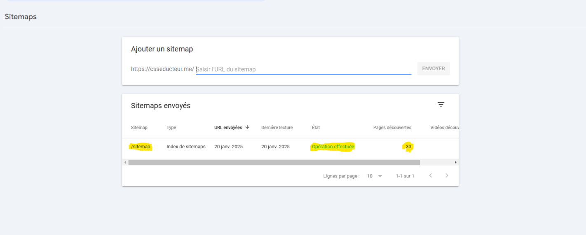
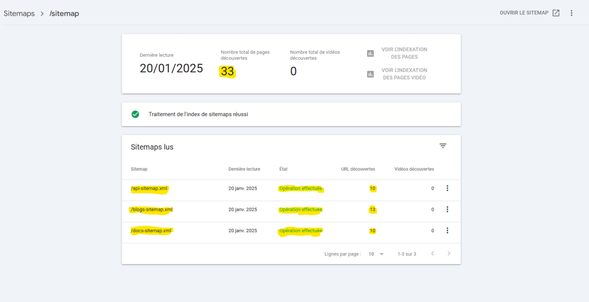
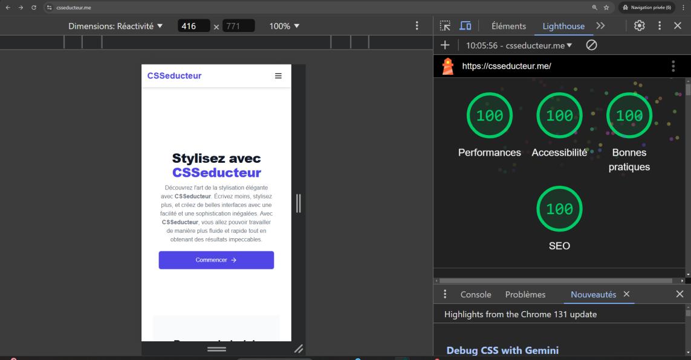
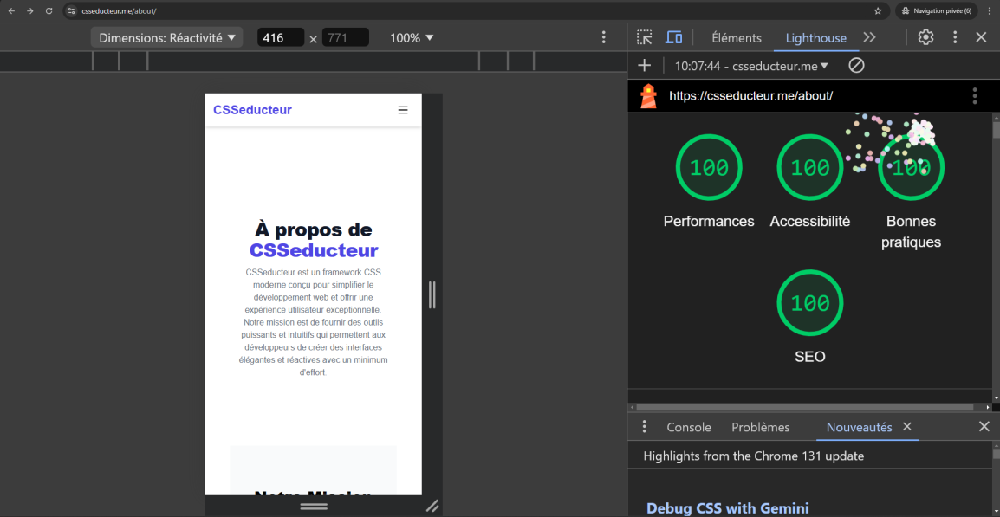
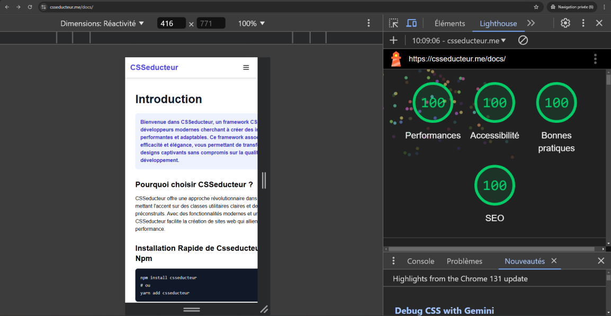
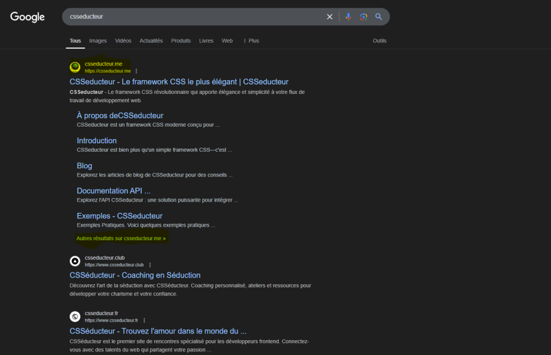
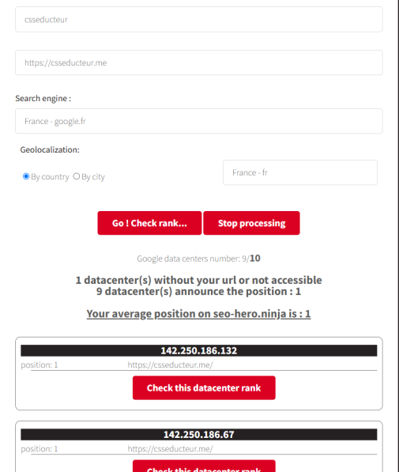
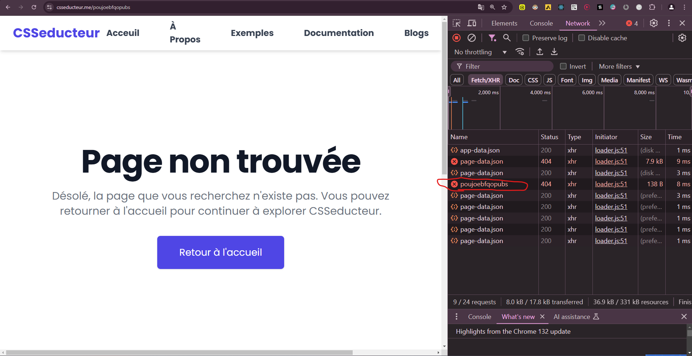

# Rapport **CSSEDUCTEUR**: Les stratégies pour être les 1er 👑

## **Sujet de notre site web:**
Csseducteur pour nous c'est un **framework CSS** *à part entière*, accompagné par sa documentation, son propre blog (forum) et même son API.

## **Nom du domain:**
on a choisit un nom de domaine qui est courant, familier par le moteur de recherche Google, un nom du domain *.**me***
Avec un **certificat SSL** (https://) qui est crucial pour le réferencement.

l'accès à notre site web: [csseducteur.me](https://csseducteur.me)

## **Téchnologie:**
la téchnologie joue un rôle très important lors d'une création d'un site web, puisqu'on veut être les premiers dans une recherche google, on a pris **GatsbyJS** un **(SSG) Static Site Generator** framework qui est fait *juste* pour le SEO et les sites haute-performances.
Nous avons tiré parti de **Gatsby** à son plein potentiel:
- Gatsby genère **tous** les pages de **toute** l'application en **build-time** ce qui fait **exploser** les performances 🚀, on a une app qui **ne fait jamais** une recharge de page en navigant dans **toute l'application**.
- Comme la génération des pages est faite dans **build-time** donc c'est même plus **seo-friendly** qu'un **SSR** (comme NextJS).
- les moteurs de recherche n'auront **jamais** besoin de executer du JS pour avoir du contenu, puisque Gatsby génère **tous** en build-time et il envoie du HTML/CSS qui est déjà riche avec le contenu !
- Utilisation de **GraphQL** pour générer les Blogs:
  - on récupère tous les blogs en format JSON, après on les transforme en composants React en utilisant la plugin `gatsby-transformer-json`, tous est automatisé par Gatsby, en modifiant `gatsby-config.js`.
  
## **Les bonnes pratiques:**
### **`<SEO />`:**
- Intégration d'un composant partagé `<SEO />` dans tous les composants qui le modifier selon le contenu.
- `<SEO />` est implémenté par le composant `react-helmet` pour avoir un `head` totalement personalisé pour chaque page.
### **Keywords:**
- On a très bien souligner le mot **Csseducteur** dans toute l'application, notamment en /api et /docs où on a essayé de mentionner **csseducteur** à 25+ occurences par page, avec un ratio mots-clés/text modéré pour ne pas avoir des pénalités par le moteur de recherche !
- On s'est inspiré du SEO des différents framework CSS tel que tailwindCSS, bootstrapCSS et Bulma (page pour la doc, api, blog...)!
### **Balisage HTML:**
- Respect des normes de balisage HTML en respectant une hiérarechie logique et cohérente.
- Utilisation d'une seule balise `<h1>` par section.
- On utilisait le moins de `divs` possible, et ils étaient remplacés par des balise appropriés (`<main>`, `<section>`, ``, etc).
### **Les Sitemaps:**
- On a définie un sitemap principal qui inclue 3 sous-sitemap [sitemap.xml (principal) ](https://csseducteur.me/sitemap.xml)
- les autres sitemap correspondent à les pages:
  - docs [sitemap des docs](https://csseducteur.me/docs-sitemap.xml).
  - api [sitemap de l'api](https://csseducteur.me/api-sitemap.xml).
  - blogs [sitemap des blogs](https://csseducteur.me/blogs-sitemap.xml).
- On a ajouté un `robots.txt` qui renvoie vers le **sitemap** principal. et ne `Disallow` aucune **route**. lien vers [robots.txt](https://csseducteur.me/robots.txt).
- On les a bien indéxé dans Google Search Console
  - 
- Google a bien parcouru le sitemap principal, et a repéré les sous-sitemaps ce qui a pu identifié nos 33 différentes pages.
  - .
### **Géneration des liens:**
- On a non seulement tiré parti de la génération avancée des liens de Gatsby mais, on a bien généré des liens très propre, d'avantage avec les blogs en plus de ça des **slugs** bien structuré et clean pour toute les routes de l'appli, exemples sur les blogs:
  - **/blogs/tutoriel-detaille-pour-utiliser-les-formulaires-dans-csseducteur/**
### **Hyper-performance du site: 🚀**
- On a obtenu un score de **100** sur toutes les **mésures** de Google Lighthouse et Google Page Insight sur quasiment **TOUTES** les pages de l'appli en selecionnant **Mobile** !
  - sur la page root **"/"**: 
  - sur la page à propos **"/about"**:  
  - sur la page de la documentation **"/docs"**: 
- Voici des liens à temps réel depuis Google **PageInsights**:
  - [Google Page Insights Pour csseducteur.me/](https://pagespeed.web.dev/analysis/https-csseducteur-me/07soz2tjlh?hl=fr&form_factor=mobile)
  - [Google Page Insights Pour csseducteur.me/about](https://pagespeed.web.dev/analysis/https-csseducteur-me-about/jmussyvdas?hl=fr&form_factor=mobile)
  - [Google Page Insights Pour csseducteur.me/docs](https://pagespeed.web.dev/analysis/https-csseducteur-me-docs/zx637uy256?hl=fr&form_factor=mobile)

### **Suivi du réferencement:**
#### **Google Search Console:**
- Utislisation de Google Search Console pour suivre l'indexation des pages, et le réferencement des pages.
  - 
#### **Réferencement sur Google**
- **1er classement** depuis **2 semaines** sur la recherche locale de google depuis mode navigation privée ! 
  - 
- de même **1er** classement sur **9 différent datacenters** depuis **2 semaines** sur **SEO-HERO NINJA** !
  -  
### **Divers:**
- On a une page didée au route qui n'existent pas, avec le code HTTP approprié !
  - 
